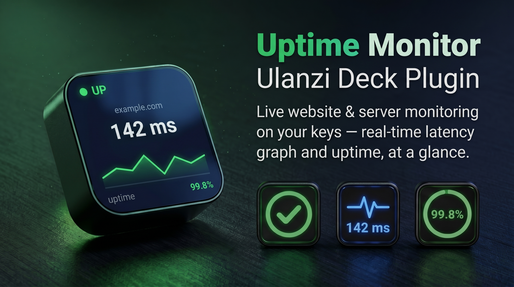

[](https://ulanzicommunitystore.narlei.com)

<p align="center">
  
  
</p>

<h1 align="center">Uptime Monitor — Ulanzi Deck Plugin</h1>

<p align="center">
  <b>Watch any website, API or server live from a key.</b><br>
  Real-time latency graph, status colors, and a blinking red alert when it goes down.
</p>

<p align="center">
  
  
  
  
</p>

---

## ✨ What it does

Type a URL — or a `host:port` — on a key and the plugin keeps probing it on a
schedule, turning the key into a live status board:

- **Two check modes** — **HTTP/HTTPS** (websites, APIs, health endpoints) or **raw TCP port** (databases, SSH, mail, game servers… anything that listens on a port).
- **Status color** — 🟢 **UP** (online), 🟠 **SLOW** (high latency / flapping), 🔴 **DOWN** (blinking alert), ⚪ **CHECK** (in flight).
- **Live latency graph** — a real-time bar chart of the last 32 checks; failed checks show a full-height red bar.
- **Current latency** in milliseconds, the **host** being watched, and the **uptime %** over the recent window.
- **Blinking red** when the site is down — impossible to miss.
- **Desktop notifications** (Windows + macOS) when a site goes **down** and when it **recovers** — fired only on transitions, no spam. The recovery alert reports the **downtime duration**, and an optional **repeat alert** nags you every N minutes while it stays down.
- **SSL certificate watch** — HTTPS keys turn orange and show `SSL 12d` when the certificate is about to expire.
- **Content (keyword) check** — verify the page **contains** (or is **missing**) a word — catches "200 OK but wrong/maintenance page".
- **Webhook alerts** — POST to **Slack / Discord / Teams** (or any endpoint) on down/recover.
- **Power options** — custom HTTP **method** (GET/HEAD), **expected status codes**, a request **header**, and **basic auth**.
- **Uptime windows + stats** — **24h** uptime on the key, **7-day** uptime in Minimal mode, plus **avg / p95** latency in Line mode (hourly buckets persist across restarts).
- **Maintenance mode** — pause checks during a deploy; the key shows **PAUSED**.
- **Press the key** to cycle the graph (Bars → Line → Minimal).

No API keys, no third-party service, no telemetry — checks are plain
HTTP/HTTPS requests (or a TCP connect) straight to your target.

---

## 🎛️ Settings

| Option | Description |
|--------|-------------|
| **Pause** | Maintenance mode — stop checking; the key shows PAUSED. |
| **Type** | **HTTP** (request a URL) or **Port (TCP)** (connect to a port). |
| **URL / Domain** | HTTP: `example.com` or `https://api.site.com/health`. TCP: `host:port` (e.g. `db.example.com:5432`). |
| **Check every** | Interval between checks, in seconds (min 3). |
| **Slow above** | Latency threshold (ms) above which the status turns orange. |
| **Timeout** | How long to wait before a check counts as down (ms). |
| **Graph** | Bars · Line (ping/latency) · Minimal. Press the key to cycle. |
| **Notifications** | Desktop alert (Windows + macOS) when the target goes down / recovers. |
| **Theme** | 10 themes — 6 dark (Midnight, Carbon, Ocean, Grape, Slate, Mono) + 4 light (Paper, Snow, Daylight, Sand). |

### Advanced (HTTP) — optional
| Option | Description |
|--------|-------------|
| **Method** | `GET` or `HEAD` (HEAD is lighter; forced to GET when a keyword is set). |
| **Expected status** | Which HTTP codes count as **up** — `200-399` (default), a list `200,204`, or ranges. |
| **Keyword** | A word the page must **contain** or be **absent** — catches wrong/maintenance pages. |
| **Header** | One custom request header, e.g. `X-Api-Key: abc123`. |
| **Basic auth** | `user:pass` for protected endpoints. |
| **SSL warn** | Turn orange + show `SSL Nd` when the cert expires within N days (`0` = off). |
| **Webhook URL** | POST a JSON message to Slack/Discord/Teams on down & recover. |
| **Repeat alert** | Re-notify every N minutes while down (`0` = off). |

- **HTTP mode:** a response outside the expected codes counts as **down** (the server answered with an error).
- **TCP mode:** a successful connection = **up**; refused/timeout = **down**. Latency = the TCP handshake time.

---

## 🌍 Languages

English · Português (BR/PT) · Español · Français · Deutsch · 日本語 · 한국어 · 中文 (简体/繁體)

UI and the built-in **tutorial page** auto-detect the Ulanzi/system language.

---

## 💾 Installation

### From the Ulanzi Store
Search for **Uptime Monitor** in the UlanziDeck plugin store and install.

### Manual / from source
1. Clone or download this repository.
2. Run `npm install` (installs the single dependency, `ws`).
3. Copy the folder `com.uptime.monitor.ulanziPlugin` into:
   - **Windows:** `%AppData%\Roaming\Ulanzi\UlanziDeck\Plugins\`
   - **macOS:** `~/Library/Application Support/Ulanzi/UlanziDeck/Plugins/`
4. Restart **UlanziDeck Studio**.

> Requires UlanziDeck software **2.1.0+**.

---

## 🛠️ Tech & compatibility

- **Cross-platform** — pure Node `http`/`https`/`net` for checks, `os`/`path` for any paths. Windows + macOS.
- **No native binaries** — single pure-JS dependency (`ws`), fully portable.
- **Per-key instances** — each key monitors its own URL on its own interval.
- **Lightweight** — the key icon is a generated SVG; the animation loop only runs while a key is unstable.
- **Debug logging** off by default; enable with `UPTIME_DEBUG=1`.

---

## 📦 Project structure

```
com.uptime.monitor.ulanziPlugin/
├── manifest.json
├── plugin/app.js               # backend: per-key monitors + SVG renderer
├── property-inspector/
│   ├── inspector.html / .js     # settings panel + live preview
│   └── tutorial.html            # modern multi-language guide
├── libs/                        # Ulanzi SDK + css
├── assets/icons/                # brand / action / category icons
├── <locale>.json                # 10 localization files
├── LICENSE
└── THIRD-PARTY-LICENSES.md
```

---

## 📄 License

Released under the **MIT License** — see [LICENSE](com.uptime.monitor.ulanziPlugin/LICENSE).
The bundled `ws` library is credited in [THIRD-PARTY-LICENSES.md](com.uptime.monitor.ulanziPlugin/THIRD-PARTY-LICENSES.md).

---

<p align="center">Made by <b>Jean Almeida</b> for the Ulanzi Deck community.</p>
